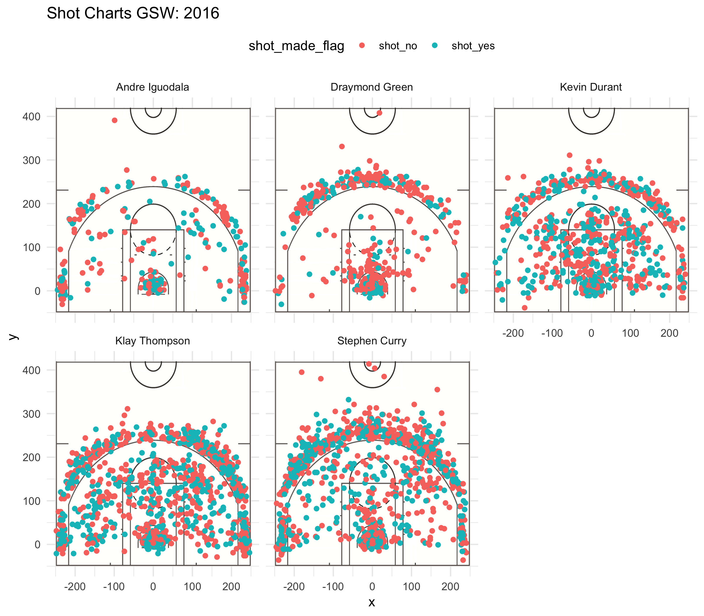

```{r echo=FALSE}
library(dplyr)
```

#**Why Does Dray Still Play When He Can't Shoot the Trey?**
###March 13th, 2017


  When Draymond Green was first drafted in the 2nd round by the Golden State Warriors with the 35th pick in the 2012 draft no one thought he would ever see substantial playing time. Throughout his college career at Michigan State (MSU) he had been a scrappy player, and the emotional leader on a Spartans team that made it to 2 Final Fours, in 4 years, success the school had not seen since the days of the legendary Magic Johnson. However, NBA scouts had their doubts on his success at the professional level because they thought Green's questionable shooting technique was unfixable, especially from deep. It's safe to say now that 4 years into his NBA not much has changed. This article makes the case that despite Draymond Green's impeccable defensive skills, he should not be in the starting lineup because of his poor shooting. The Warriors have several other players to turn to that could match Draymond's exceptional defense, yet add more points and more efficient shooting to an already stacked Warriors squad.
  
  The NBA has turned into a 3-point shooters paradise, due in large part to the revolution led by Green's teammates Steph Curry and Klay Thompson, playfully dubbed the Splash Brothers. 3-point shooting across the league is at an all-time high and the numbers of both attempts and makes continue to rise with every season. And simply put, Draymond is not keeping up. Not with his team or the league. As the following 3 point effectiveness chart points out. As the data points out he not only shoots almost 10 percentage points than Steph Curry *(31.9 compared to 40.8%)*, he also takes almost 1/3 of the total attempts *(232 vs. 687)*. In a league that is trending towards a monstrous increase in 3 pointers because of the larger expected values. Green should be towards more, not less 3 pointers if he wants to stay relevant in the league.

```{r}
getwd()
```

```{r echo=FALSE}
gsw <- read.csv(file="../data/shots-ddta.csv")
```
```{r echo=F}
three_point_effective_percentage<- filter(gsw, shot_type=="3PT Field Goal") %>%group_by(player)%>%summarise(total=sum(shot_type=="3PT Field Goal"), made=sum(shot_made_flag=="shot_yes"), perc_made=(made/total)*100)%>% arrange(desc(perc_made))
```
```{r}
three_point_effective_percentage
```
  Now it may be the case that Green's teammates are simply out of this world, they have won 2 of the past 3 championships after all. Not only that, but Curry and Klay will likely go down as two of the best shooters in history both in total numbers and percentages. Their 280 and 246 respective 3-pointers (from above table) are not career highs, but certainly sit atop the league. Durant himself is no slag with 105 3-pointers while hitting at a 38.6% clip, and is only a few years off of an MVP season and is currently the definitive 2nd best player/scorer in the league behind all-time great Lebron James. Of course anybody compared to these goliaths would seem like an awful shooter who shouldn't be on the floor.
  If we look strictly at the numbers, perhaps Draymond's one saving grace is his perfectly adequate 2-point shooting percentage, which is relatively close to his teammates.  
```{r echo=F}
two_point_effective_percentage<- filter(gsw, shot_type=="2PT Field Goal") %>%group_by(player)%>%summarise(total=sum(shot_type=="2PT Field Goal"), made=sum(shot_made_flag=="shot_yes"), perc_made=(made/total)*100) %>% arrange(desc(perc_made))
```
```{r}
two_point_effective_percentage
```  
  Even though he is last in percentage points behind selected players on the Warriors, for all intents and purposes he makes half the shots he takes. Ignoring volume, Green is only 2 percentage points behind Klay Thompson, and 5% behind Steph Curry. All this would be comforting to see 10, even as recently as 5 years ago. However, as mentioned before this is a 3-point league and as everyone's range keeps expanding, the role of the  traditional player who can score the 2 relatively efficiently is slowly getting phased out.

Green's 2 point scoring gets even more alarming when you analyze his shot charts in graphic form.


```{r out.width='80%', echo=FALSE, fig.align='center'}



```
  Draymond Green's shot chart is the second box on the first row. Any red dot shot inside the outer ring is a missed 2 pointer. Further specifying, any red dot inside the inner box is a missed shot in the key. If the ball is shot within the key and withing 3 feet of the basket it is considered a lay-up, the easiest shot in basketball due to your proximity to the rim. The amount of Green's missed layups are concerning. Not everyone can consistently hit 3-pointers, and that is understandable. But if that's the case, an NBA player better be able to score in other ways to keep his job and the opposing defense honest. For most, that is the lay-up. Other teammates like Durant, Thompson, an Curry may be shooting at similar rates to Draymond, but at least they make the easy lay-ins, which are necessary to win games. Looking at all his misses in the paint close to the basket gives us a better picture on weaknesses in his game, and mars his deceptively average two-point shooting percentage.
  
  Unsurprisingly, Draymond's disparities between his teammates grow even more when we compare his total effective shooting  percentage (field goal percentage that includes both two-pointers and three-pointers). He is 13% points lower than the team leader Kevin Durant in percentage points, 5% lower than Thompson and 4% lower than Curry despite facing less defensive pressure from opposing teams and taking far less shots than these scorers.  
```{r echo=F}
total_effective_shooting_percentage <- group_by(gsw, player)%>% summarise(total=sum(shot_type=="2PT Field Goal"|shot_type=="3PT Field Goal"),made=sum(shot_made_flag=="shot_yes"), perc_made=(made/total)*100) %>% arrange(desc(perc_made))
```
```{r}
total_effective_shooting_percentage
```


###Andre is the Answer
  What is the solution you may ask? The Golden State Warriors should replace Dryamond Green with Andre Iguodala in the starting lineup going forward.
  
  
  
  Despite coming off the bench, Iguodala is far and away superior to Green on the offensive end. This backed up both statistically and graphically. 
  In fact, percentage-wise, Iguodala is the 2nd best shooter on the team for the 2016-2017 season, and 1st when it comes to 2 pointers. Meanwhile, Draymond is consistently in last in all shooting categories among minute-leaders no matter where he shoots it from.
    Not only that, but Iguodala consistently makes his lay-ups close to the basket, unlike Green who is a lot less consistent of a shooter from close range (refer to shot chart).
  While true that their 3 point field goal percentage is comparable (Iguoadala's 36% compared to Green's 31.9), 4% makes a difference over an 82 game season. Not only that, but once the playoffs hitk there is  a potential for 28 additional games. 
  
  As most NBA fans know, Green is in the Warriors starting lineup for his defensive contributions. He was so dominant that he won the Defensive Player of the Year award for the 2016-2017 season. While this exercise does not delve into defensive statistics (which are much harder to quantitively measure), Iguodala would not be much of a drop-off from Green. He is fundamentally sound, and often tasked with defending the opposing team's best scorer. Not only that, but Andre was granted the prestigious NBA Finals MVP in 2015 due in large part to his stellar defensive play against Lebron James. The great things Green does for the Warriors can be matched and perhaps even bettered by Iguodala.
  
  Draymond Green is undoubtedly a great player, and a true rags to riches tale. He was overlooked as an NBA prospect, but became a starter on a dynastic team by putting in hard work and showing sheer grit and tenacity on the court. However, if he wants to keep his starting position, and wants to stay relevant in a 3-point dominated league, he'll have to put that same effort into improving his shooting. Until that happens, Warriors fans should be clamoring for Coach Steve Kerr to let Andre Iguodala lead in the interim.


